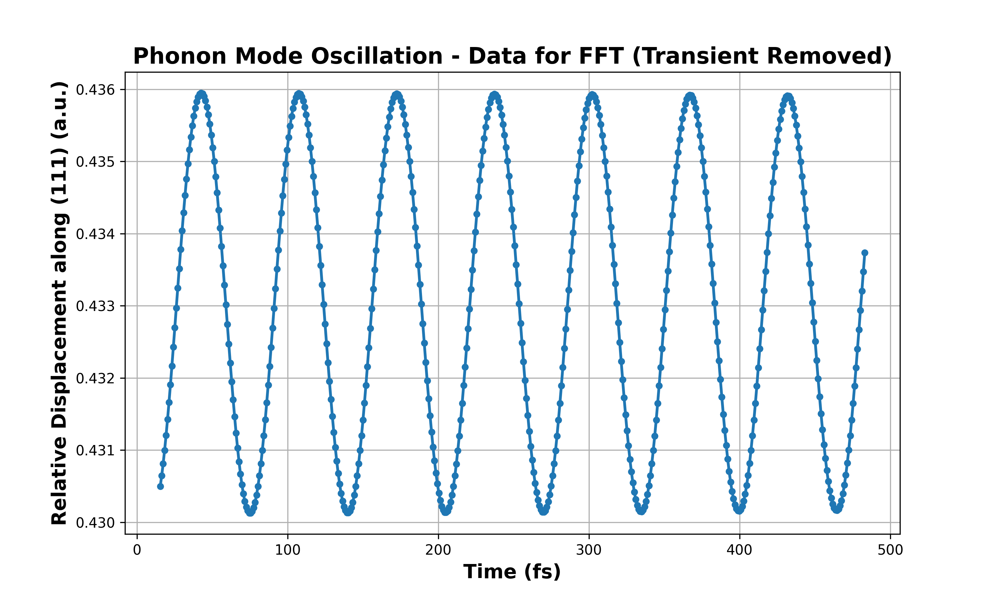

# First-Principles Study of Crystalline Silicon with Quantum ESPRESSO

*The calculated electronic band structure of silicon, clearly showing its nature as an indirect-gap semiconductor. This calculation was performed using Density Functional Theory.*

---

## 📖 Table of Contents

-   [1. Project Overview](#1-project-overview)
-   [2. Scientific Goal and Methodology](#2-scientific-goal-and-methodology)
-   [3. Convergence and Structural Properties](#3-convergence-and-structural-properties)
-   [4. Electronic Properties: Band Structure and DOS](#4-electronic-properties-band-structure-and-dos)
-   [5. Vibrational Properties: Phonon Frequency](#5-vibrational-properties-phonon-frequency)
-   [6. How to Reproduce This Study](#6-how-to-reproduce-this-study)
-   [7. Technologies Used](#7-technologies-used)

---

## 1. Project Overview

This repository contains a comprehensive computational study of the fundamental properties of crystalline silicon (Si) using the **Quantum ESPRESSO** software suite. The project employs **Density Functional Theory (DFT)** to systematically characterize the structural, electronic, and vibrational properties of bulk silicon from first principles.

The primary objectives are:
-   To determine the equilibrium lattice constant and bulk modulus through a careful convergence study and an equation of state analysis.
-   To calculate the electronic band structure and Density of States (DOS) to identify the nature and magnitude of the electronic band gap.
-   To compute the frequency of the zone-center optical phonon using *ab initio* Molecular Dynamics (MD).

Throughout the study, all calculated results are rigorously validated against established experimental values, highlighting both the predictive power and the known limitations of the PBE exchange-correlation functional.

---

## 2. Scientific Goal and Methodology

The core of this work is to leverage DFT to model crystalline silicon in its diamond cubic structure. All calculations were performed using the **Perdew-Burke-Ernzerhof (PBE)** functional within the Generalized Gradient Approximation (GGA). The interaction between ions and valence electrons was described by norm-conserving pseudopotentials.

---

## 3. Convergence and Structural Properties

A crucial first step in any DFT calculation is to ensure numerical convergence. We performed a systematic study to determine the optimal **kinetic energy cutoff (`ecutwfc`)** and **k-point mesh density**. Our analysis concluded that an energy cutoff of **55 Ry** and a **6x6x6** Monkhorst-Pack k-point grid provide results converged to within 1 mRy, balancing accuracy and computational cost.

| Energy vs. Ecut Convergence                      | Energy vs. K-Point Convergence                   |
| -------------------------------------------------- | ------------------------------------------------ |
|  |  |

With these converged parameters, we calculated the total energy for various lattice constants and fitted the data to the **Murnaghan equation of state**.

This analysis yielded the equilibrium lattice constant and bulk modulus, which are in excellent agreement with experimental data:

| Property                             | Calculated (PBE) | Experimental |
| :----------------------------------- | :--------------- | :----------- |
| **Lattice constant, $a_0$ (\AA)**      | 5.416            | 5.431        |
| **Bulk modulus, $B_0$ (GPa)**        | 93.3             | 98           |
| **Relative Error ($a_0$)**           | -0.28%           | -            |

This slight underestimation is a well-known and expected characteristic of the PBE functional for covalently bonded semiconductors.

---

## 4. Electronic Properties: Band Structure and DOS

The electronic band structure and Density of States (DOS) were calculated to understand silicon's semiconductor nature.

The calculated band structure confirms that silicon is an **indirect band-gap semiconductor**, with the Valence Band Maximum (VBM) at the $\Gamma$ point and the Conduction Band Minimum (CBM) along the $\Gamma$-X direction. Our calculated indirect gap is **1.01 eV**.

The DOS analysis corroborates this finding, showing a clear energy gap of approximately 1.0 eV between the valence and conduction bands. Both results show the well-known underestimation of the experimental band gap (~1.17 eV), a typical limitation of standard DFT functionals.

| Band Structure of Silicon                           | Density of States (DOS)                                 |
| --------------------------------------------------- | ------------------------------------------------------- |
|  |  |

---

## 5. Vibrational Properties: Phonon Frequency

The frequency of the zone-center optical phonon was determined using a direct method based on *ab initio* Molecular Dynamics. We excited the optical mode by displacing the atoms in the primitive cell and then simulated their evolution in a microcanonical (NVE) ensemble.

By performing a Fast Fourier Transform (FFT) on the time evolution of the atomic displacement, we identified the dominant vibrational frequency.

| Atomic Displacement in MD                             | Fourier Spectrum of Displacement                          |
| ----------------------------------------------------- | --------------------------------------------------------- |
|  |  |

Our calculated frequency of **14.94 THz** is in excellent agreement with the experimental value of ~15.52 THz, with a relative error of only **-3.7%**. This result validates the accuracy of the interatomic forces predicted by our DFT model.

---

## 6. How to Reproduce This Study

### Prerequisites
-   A working installation of [Quantum ESPRESSO](https://www.quantum-espresso.org/).
-   Python with `numpy`, `scipy`, and `matplotlib` for data analysis and plotting (or MATLAB).

### Steps
1.  **Convergence and EOS:** Run the series of SCF calculations for the convergence study and the equation of state as detailed in the input files in the `1-structural/` directory.
2.  **Band Structure and DOS:** Use the `2-electronic/` directory scripts. First, run the `scf` calculation, followed by `bands` and `dos` non-self-consistent calculations. Then, use the post-processing tools (`bands.x`, `dos.x`) to generate the data.
3.  **Phonon Calculation:** In the `3-vibrational/` directory, run the `md` input file to perform the NVE molecular dynamics simulation.
4.  **Analysis:** Use the provided Python or MATLAB scripts to process the output files from Quantum ESPRESSO and generate the plots shown in this `README`.

---

## 7. Technologies Used

-   **DFT Engine:** [Quantum ESPRESSO](https://www.quantum-espresso.org/)
-   **Exchange-Correlation Functional:** PBE (Perdew-Burke-Ernzerhof)
-   **Data Analysis & Plotting:** Python (NumPy, SciPy, Matplotlib), MATLAB
-   **Documentation:** LaTeX
